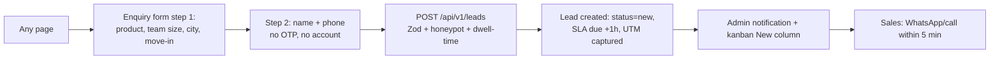
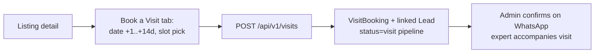
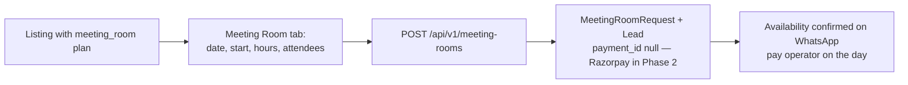
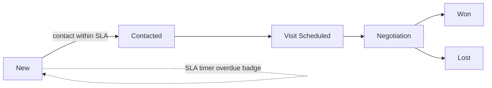

# Amadhi.com — Product Requirements Document

**Product:** Amadhi — Delhi NCR's premium coworking & managed office marketplace
**Tagline:** Your space to grow
**Markets:** Gurugram, Noida, Delhi — *only*. **No Day Pass product. No end-user accounts. Lead-gen conversion model. Free-first stack on a single Hostinger KVM VPS.**

## 1. Problem & Opportunity

Finding workspace in Delhi NCR is opaque: stale listings, phantom pricing, broker-driven incentives. Existing aggregators optimise for breadth over depth. Amadhi wins by being deliberately narrow (3 cities), deeply verified (every space visited), and conversion-honest (zero brokerage, <5-min response SLA).

## 2. Goals & Success Metrics

| Goal | Metric | Target (6 mo post-launch) |
|---|---|---|
| Organic acquisition | Indexed programmatic pages / impressions | 150+ quality pages, 100k impressions/mo |
| Lead generation | Enquiries + visits + room requests / mo | 500/mo |
| Lead quality | Enquiry→visit conversion | ≥25% |
| Responsiveness | First-response SLA hit rate | ≥95% under 1h (target <5 min) |
| Performance | Lighthouse mobile / LCP | ≥95 / <2.0s |
| Cost | Mandatory SaaS spend | ₹0 (VPS + domain only) |

## 3. Scope (Phase 1)

**Public site (account-free):** homepage; 7 product hubs; 21 product×city pages; locality pages (≥3-listing publish gate); workspace detail; search + filters + map; compare (3, localStorage); wishlist + recently-viewed (localStorage); blog + authors; about/contact/list-your-space; legal.

**Conversions:** 2-step enquiry (no OTP), Book-a-Visit slot request, meeting-room booking request, WhatsApp deep link, call click, email-gated brochure download, moderated review submission, notify-me on empty inventory, partner ("List your space") lead.

**Admin (only authenticated surface, Auth.js credentials + RBAC):** KPI dashboard, lead kanban with SLA timers + CSV export + wa.me quick actions, listing management (status/flags/core content), blog CMS (Tiptap + markdown), review moderation with aggregate recompute, settings, activity log. Roles: Super Admin, Admin, Content Writer, SEO Executive, Sales Manager, Sales Executive, Viewer.

**Out of scope (Phase 2+):** payments (Razorpay — schema already reserves `payment_id`), WhatsApp Business API, Meilisearch, user accounts, additional micro-markets.

## 4. Personas (NCR-specific)

1. **Priya, 28 — Freelance designer (Delhi).** Wants a dedicated desk near a Yellow Line station under ₹8k. Mobile-first, WhatsApp-native, hates sales calls. *Needs: transparent pricing, metro distance, instant WhatsApp.*
2. **Rohan, 34 — Startup founder, 12-person team (Gurugram).** Series-A, needs a private cabin/managed office near Cyber City within 3 weeks. Compares 3 options, decides fast. *Needs: compare tool, visit booking, negotiation help.*
3. **Meenakshi, 41 — HR lead at a GCC (Noida).** Sourcing 80–150 seats, needs process: brochures, floor plans, SLAs, a named account manager. *Needs: enterprise desk, managed-office content, brochure download, email trail.*
4. **Suresh, 52 — CA/consultant (Delhi).** Needs a virtual office for client GST registrations, repeatedly. *Needs: document list, turnaround promise, verification-tested addresses.*
5. **Amit, 38 — Sales head (travels NCR).** Books meeting rooms near clients weekly. *Needs: hourly pricing, capacity/AV filters, fast confirmation.*

## 5. User Flows

### Enquiry (primary conversion)


### Book a Visit


### Meeting-room request


### Admin lead handling


## 6. Information Architecture & Sitemap (3 cities only)

```
/                                   Homepage
/{product}                          7 hubs: coworking-space, managed-office, private-cabin,
                                    dedicated-desk, meeting-rooms, office-leasing, virtual-office
/{product}/{city}                   21 pages (7 × gurugram|noida|delhi)
/{product}/{city}/{locality}        22 seeded localities × 7 products
                                    (indexed only when ≥3 live listings; else noindex +
                                     canonical to city page)
/spaces/{slug}                      Workspace detail (47 seeded)
/search                             Filterable search (noindex)
/compare, /wishlist                 localStorage tools (noindex)
/blog                               Index
/blog/{category}                    7 categories
/blog/{category}/{slug}             Posts
/blog/author/{slug}                 EEAT author pages
/about, /contact, /list-your-space, /privacy, /terms
/admin/**                           Auth.js-protected (noindex, robots-disallowed)
/sitemap.xml, /robots.txt           Auto-generated with quality gate
```

**Locality seed list** — Gurugram: Cyber City, Golf Course Road, Golf Course Extension, MG Road, Udyog Vihar, Sohna Road, Sector 44, Sector 18. Noida: Sector 62, 63, 16, 18, 125, Noida Expressway. Delhi: Connaught Place, Nehru Place, Saket, Okhla, Aerocity, Jasola, Netaji Subhash Place, Mohan Cooperative.

## 7. Non-functional Requirements

- **Performance:** Lighthouse ≥95 mobile, LCP <2.0s, CLS <0.05, INP <200ms (see `06-performance.md`).
- **Accessibility:** WCAG 2.2 AA (tokens at 4.5:1, keyboard nav, ARIA on all disclosure widgets, 44px targets, reduced-motion respected).
- **SEO:** full JSON-LD suite, self-canonicals, ISR-fresh sitemaps (see `05-seo.md`).
- **Security:** headers, bcrypt, RBAC, rate limits, honeypots, UFW/fail2ban (see `07-security.md`).
- **Cost:** runs entirely on one 2 vCPU/8 GB VPS + free tiers (Cloudflare, Cloudinary, GA4, Clarity, Brevo, UptimeRobot, GitHub Actions).
